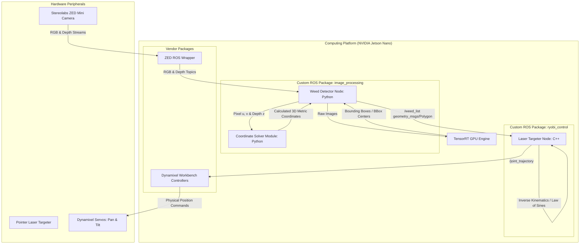

# 🤖 Ryobi Weed Detection & Pointer Laser Targeting System

A ROS (Robot Operating System) robotic vision and laser-targeting pipeline deployed on the **NVIDIA Jetson Nano** platform. This repository integrates object detection via **YOLOv8** accelerated with **TensorRT**, spatial coordinate solving using **ZED Mini** stereo camera intrinsics, and physical target acquisition using a custom **Dynamixel** pan-tilt servo mechanism guiding a pointer laser.

> [!NOTE]
> **Hardware Demonstration Note:** Due to project budget limitations, a low-cost, safe **pointer laser** was used instead of a high-power agricultural/thermal laser to demonstrate the targeting capabilities of the system.

---

## 📐 System Architecture



---

## 📦 Workspace Package Breakdown (Custom vs. Vendor)

To ensure this workspace compiles and runs out-of-the-box on the Jetson Nano, standard hardware drivers are included alongside custom code:

### 🛠️ Custom Packages (Developed for this Robot)
*   **`image_processing`**:
    *   `scripts/weed_detector.py`: Handshakes with TensorRT and CUDA execution context for custom YOLOv8 model inference.
    *   `scripts/weed_coordinate_solver.py`: Implements coordinates transformation logic from the camera frame to the robot ground frame.
*   **`ryobi_control`**:
    *   `src/laser_targeter.cpp` & `src/main_node.cpp`: Performs coordinate translation offsets, runs inverse kinematics, and commands the servos.
    *   `config/dynamixel_config.yaml` & `launch/dynamixel.launch`: Custom servo IDs and hardware interfaces.

### 🔌 Vendor Drivers (Standard Libraries - Unmodified)
*   **`zed-ros-wrapper` & `zed-ros-interfaces`**: Standard packages provided by **Stereolabs** to interface with the ZED Mini camera. Their internal READMEs and source files are official documentation. The only modification made is within `zed_wrapper/params/common.yaml` to configure resolution (1080p) and frame rates optimized for the Jetson Nano.
*   **`dynamixel_workbench`**: Standard workbench package provided by **ROBOTIS** to interface with Dynamixel actuator protocols.

---

## 💻 Hardware Specifications & Configuration

| Hardware Component | Model / Spec | Role in System |
| :--- | :--- | :--- |
| **Computing Unit** | NVIDIA Jetson Nano (4GB RAM) | Runs ROS Master, GPU TensorRT Inference, and Inverse Kinematics. |
| **Vision Sensor** | Stereolabs ZED Mini | Captures stereoscopic RGB and Depth streams. |
| **Pan-Tilt Actuators** | Dynamixel Servos (MX-series) | ID 1 (Pan) & ID 2 (Tilt). Controls angular targeting. |
| **Targeting Indicator** | Pointer Laser | Low-cost laser pointer used for target visualization. |
| **Communication Interface** | USB-to-RS485 (U2D2) | Translates USB packages to Dynamixel half-duplex TTL/RS485 signals. |

---

## 🧠 Software Architecture & Algorithmic Pipeline

### 1. Vision & Object Detection (`weed_detector.py`)
- **Acceleration**: Custom YOLOv8 model compiled into a **TensorRT Engine** (`new_weed_detector.engine`) to bypass PyTorch runtime overhead and run natively on the Jetson Nano GPU.
- **Triggered Execution**: Operates via a `/process_latest_image` ROS service, allowing on-demand camera frame processing to save CPU/GPU cycles.

### 2. Spatial 3D Coordinate Solver (`weed_coordinate_solver.py`)
Translates $2\text{D}$ pixel coordinates $(u, v)$ from the camera feed into $3\text{D}$ coordinates $(X_g, Y_g, Z_g)$ relative to the ground origin directly beneath the camera.

#### Mathematical Coordinate Transformation Pipeline:
1. **Optical Camera Frame Projection**:
   $$x_c = \frac{z_{depth} \cdot (u - c_x)}{f_x}, \quad y_c = \frac{z_{depth} \cdot (v - c_y)}{f_y}, \quad z_c = z_{depth}$$
2. **Standard Camera Coordinate Frame**:
   $$x_c' = z_c, \quad y_c' = -x_c, \quad z_c' = -y_c$$
3. **Pitch Angle Rotation** ($\theta_{pitch} = 37.7425^\circ$):
   $$x_{rot} = x_c' \cos(\theta_{pitch}) + z_c' \sin(\theta_{pitch})$$
   $$y_{rot} = y_c'$$
   $$z_{rot} = -x_c' \sin(\theta_{pitch}) + z_c' \cos(\theta_{pitch})$$
4. **Ground Translation**:
   $$X_g = x_{rot}, \quad Y_g = y_{rot}, \quad Z_g = z_{rot} + h_{camera}$$
   *Where $h_{camera} = 0.35472\text{ m}$ is the camera height.*
5. **Blinding Fallback (Geometric Ground Plane Intersection)**:
   If depth readings are invalid, the solver shoots a mathematical ray onto the ground plane ($Z_g = 0$):
   $$z_{depth} = \frac{h_{camera}}{\sin(\theta_{pitch}) + \frac{(v - c_y)}{f_y} \cos(\theta_{pitch})}$$

---

### 3. Laser Kinematics & Aiming (`laser_targeter.cpp`)
Calculates Pan and Tilt angles using kinematic offsets and geometry.

- **Translation Offset**: A physical $5\text{cm}$ offset along the $X$-axis accounts for the camera-to-laser distance:
  $$x_{rel} = x_g + 0.05, \quad y_{rel} = y_g$$
- **Pan Angle ($\theta_{pan}$)**:
  $$\theta_{pan} = 0.26 + \text{atan2}(y_{rel}, x_{rel})$$
- **Tilt Angle ($\theta_{tilt}$)**:
  Resolved using a physical bracket of length $a = 0.055\text{ m}$, mounting angle $\beta$ (default $\approx 0.2856\text{ rad}$), and the **Law of Sines**:
  $$\text{hyp} = \sqrt{z_{laser}^2 + r^2} \quad \text{where } r = \sqrt{x_{rel}^2 + y_{rel}^2}$$
  $$\sin(\gamma) = \frac{a \cdot \sin(\pi - \beta)}{\text{hyp}}$$
  $$\theta_{tilt} = -0.09 + \left( \frac{\pi}{2} - (\beta - \gamma) - \text{atan2}(r, z_{laser}) \right)$$
  *(Angles are software-bounded to: Pan $[-0.5, 1.2]\text{ rad}$, Tilt $[-0.6, 0.6]\text{ rad}$).*

---

## 🚀 Deployment & Execution Guide

### 1. Build the Workspace
Clean, configure, and compile the workspace on the Jetson Nano:
```bash
cd ~/catkin_ws
catkin_make -DCATKIN_WHITELIST_PACKAGES="ryobi_control;image_processing"
source devel/setup.bash
```

### 2. Launching the Whole System
To spin up all nodes (ZED Mini camera wrapper, TensorRT detector, Dynamixel drivers, laser targeting solver):
```bash
roslaunch ryobi_control ryobi_bringup.launch
```

### 3. Launching Components Individually
For debugging, open separate terminals:
* **ZED Camera Wrapper**:
  ```bash
  roslaunch zed_wrapper zedm.launch
  ```
* **Weed Detector Node**:
  ```bash
  rosrun image_processing weed_detector.py
  ```
* **Dynamixel Servo Controller**:
  ```bash
  roslaunch ryobi_control dynamixel.launch
  ```
* **Laser Targeter Node**:
  ```bash
  rosrun ryobi_control laser_targeter

### 4. Running the Operation (Service Commands)
Once the system is launched, the nodes run in the background in an `IDLE` state. You can trigger actions by calling the following ROS services in a new terminal:

*   **Trigger Full Detection and Targeting Cycle**:
    ```bash
    rosservice call /start_targeting
    ```
    *This runs a single-shot object detection on the latest synchronized ZED frame, calculates coordinates and kinematics offsets, and guides the pointer laser to aim at each detected weed sequentially.*

*   **Manual Target Aiming Command**:
    To target a specific physical 3D coordinate $(x, y, z)$ manually:
    ```bash
    rosservice call /target_coordinate "{x: 0.35, y: -0.1, z: 0.0, laser_z: 0.6, beta: 0.2856}"
    ```

*   **Validate Pan & Tilt Servos**:
    To send raw target angles (in radians) directly to verify servo motion limits:
    ```bash
    rosservice call /test_servos "{pan: 0.5, tilt: 0.1}"
    ```

---

## 📡 ROS API Reference

### Published Topics
* `/weed_list` (`geometry_msgs/Polygon`): Metric coordinate array of detected weeds.
* `/yolo/annotated_image/compressed` (`sensor_msgs/CompressedImage`): Compressed annotated JPEG stream with real-time center markers and depth values.
* `/dynamixel_workbench/joint_trajectory` (`trajectory_msgs/JointTrajectory`): Direct commands to the pan/tilt Dynamixel workbench driver.

### ROS Services
* `/start_targeting` (`std_srvs/Trigger`): Runs the full vision-to-aim pipeline.
* `/process_latest_image` (`std_srvs/Trigger`): Captures one frame and performs weed detection.
* `/target_coordinate` (`ryobi_control/TargetCoordinate`): Manually commands the laser targeting node to calculate angles and aim at coordinate $(x, y, z)$.
* `/test_servos` (`ryobi_control/TestServos`): Forces pan and tilt servos to exact raw angles for validation.
